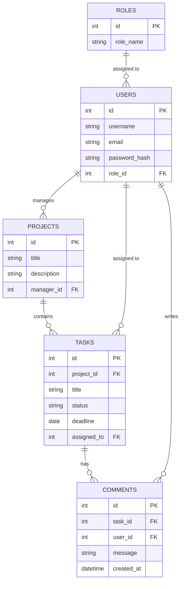

# ER Diagram (Database Schema)

The Entity Relationship (ER) Diagram represents the database structure, focusing on tables, primary/foreign keys, and the relations between entities.

```mermaid
erDiagram
    USERS {
        int id PK
        string username
        string email
        string password_hash
        int role_id FK
    }
    ROLES {
        int id PK
        string role_name
    }
    PROJECTS {
        int id PK
        string title
        string description
        int manager_id FK
    }
    TASKS {
        int id PK
        int project_id FK
        string title
        string status
        date deadline
        int assigned_to FK
    }
    COMMENTS {
        int id PK
        int task_id FK
        int user_id FK
        string message
        datetime created_at
    }

    ROLES ||--o{ USERS : "assigned to"
    USERS ||--o{ PROJECTS : "manages"
    PROJECTS ||--o{ TASKS : "contains"
    USERS ||--o{ TASKS : "assigned to"
    TASKS ||--o{ COMMENTS : "has"
    USERS ||--o{ COMMENTS : "writes"
```
