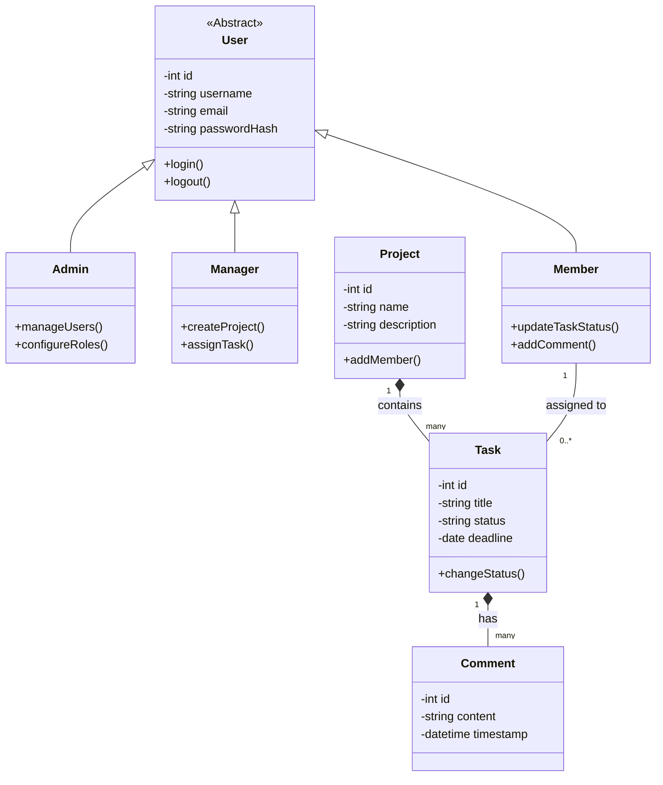

# Class Diagram (UML)

The Class Diagram outlines the major classes, their attributes, methods, and the relationships (Inheritance, Association, Composition) between them. This focuses on the OOP principles required for the backend.

