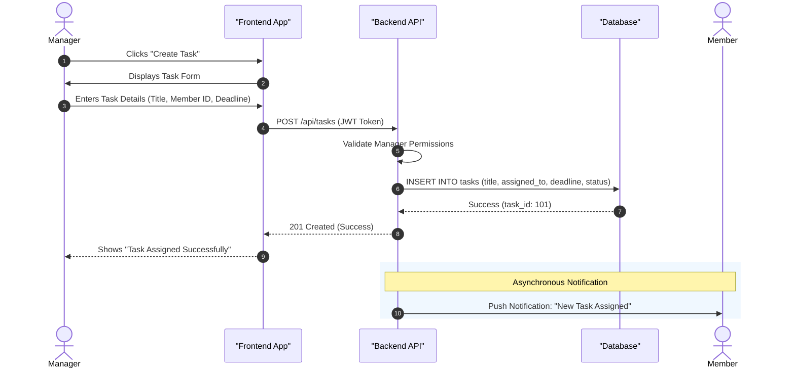

# Sequence Diagram

This diagram shows the end-to-end flow of the most critical system process: **Creating and Assigning a Task**.

## Diagram Visualization

## Mermaid Representation
You can recreate or edit this diagram using [Mermaid Live Editor](https://mermaid.live/).

