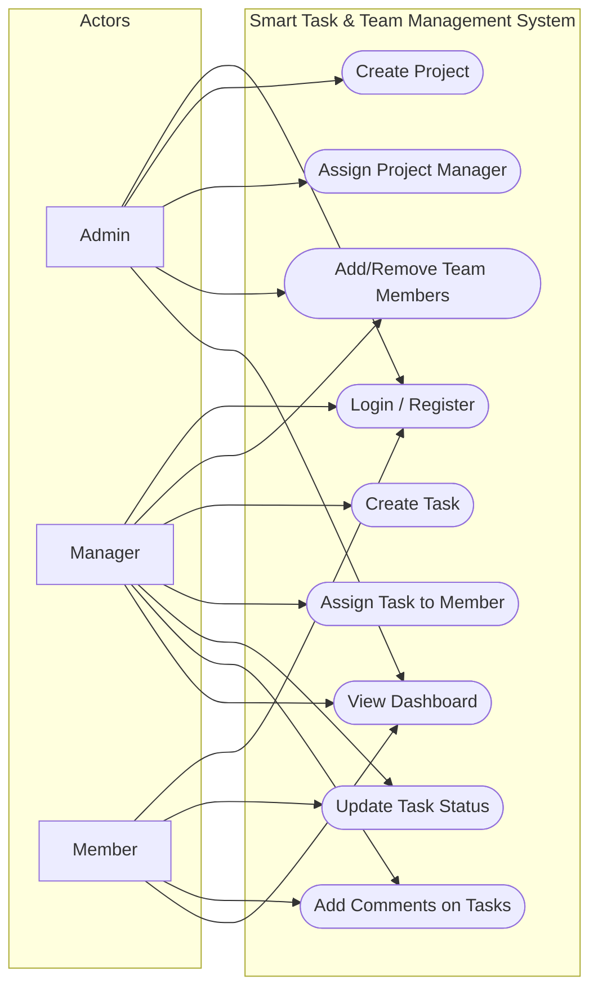

# Use Case Diagram

This diagram illustrates the interactions between the different roles (Actors) and the system's key features (Use Cases).

```mermaid
flowchart LR
    subgraph Actors
        Admin
        Manager
        Member
    end

    subgraph "Smart Task & Team Management System"
        UC1([Login / Register])
        UC2([Create Project])
        UC3([Assign Project Manager])
        UC4([Add/Remove Team Members])
        UC5([Create Task])
        UC6([Assign Task to Member])
        UC7([Update Task Status])
        UC8([Add Comments on Tasks])
        UC9([View Dashboard])
    end

    Admin --> UC1
    Admin --> UC2
    Admin --> UC3
    Admin --> UC4
    Admin --> UC9

    Manager --> UC1
    Manager --> UC4
    Manager --> UC5
    Manager --> UC6
    Manager --> UC7
    Manager --> UC8
    Manager --> UC9

    Member --> UC1
    Member --> UC7
    Member --> UC8
    Member --> UC9
```
